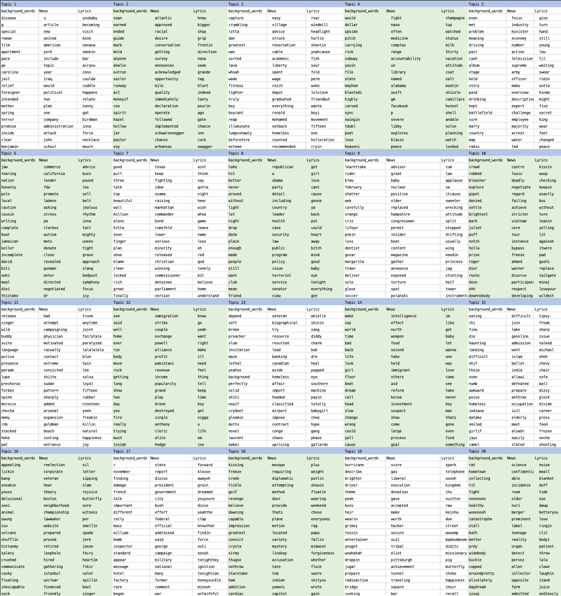
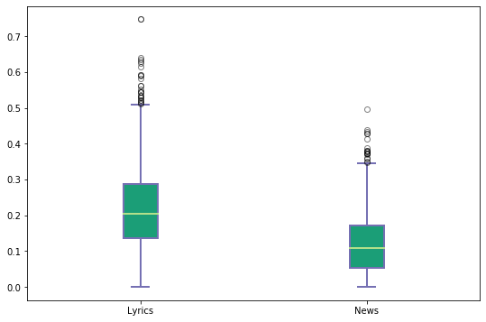
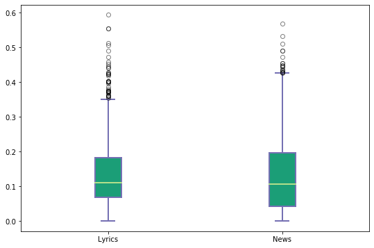
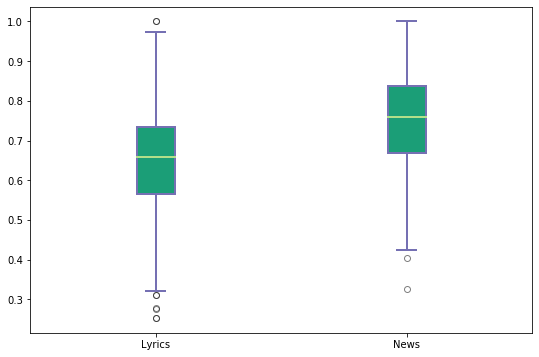
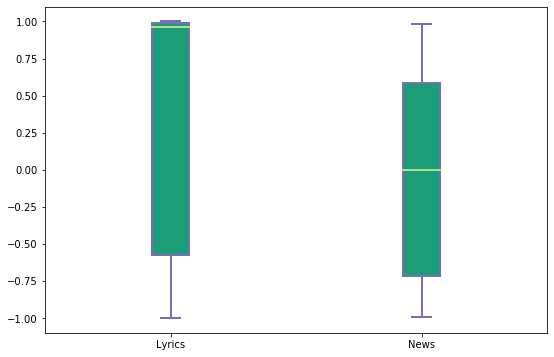

# Final_project

## Group members:
- Tzu-Kun Hsiao(TK-Hsiao)
- Samantha Lynn Walkow(swalkow2)
- Yuerong Hu(Yuerong2)

## Project Name:
- Project Types II: The semantic agreement between fictional corpus and real-word incidents: a case study on the song lyrics and news between 2000-2015.

## Hypotheses:
- 1. Popular songs (lyrics) and news coming out during the same period of time (etc, five years from 2000 to 2005) share certain features that were shaped by the culture and theme of the society during that period.
- 2. There might be a time delay between the similar groups of topics extracted from popular songs and those of the news. Since news always comes out quickly right after the things happened, while it takes a long time to write and publish a song.

## Data

- Songs:   
  https://www.kaggle.com/rakannimer/billboard-lyrics [coverage: 1965-2015)]
  - This dataset contains the top 100 songs per year, from 1965-2015.
  - We picked the songs published between 2001-2015.
  - 5,100 songs were in the dataset; 1,500 songs were published between 2001-2015
- News:  in progress of data wrangling   
  Newspaper Source (Database host by Ebsco)   
  http://web.a.ebscohost.com.proxy2.library.illinois.edu/ehost/search/advanced?vid=0&sid=3c64557f-5146-433d-891a-724ed9e12b3d%40sdc-v-sessmgr01   
  (or can be accessed from UIUC library database catalog)
  - Coverage: Identifies articles in regional U.S. newspapers, international newspapers, newswires and newspaper columns, as well as TV and radio news transcripts. Provides cover-to-cover full text for over 20 national (U.S.) and international newspapers, including USA Today, The Christian Science Monitor, The Washington Post, The Times (London), The Toronto Star, etc. Also contains selected full text from more than 200 regional (U.S.) newspapers, including The Boston Globe, The Chicago Tribune, The Detroit Free Press, The Miami Herald, The New York Daily News, The San Jose Mercury News, etc. In addition, full text television & radio news transcripts are provided from CBS News, FOX News, NPR, etc.
  - We searched news published in New York Times, between 2001-2015.
  - 46,055 abstracts and titles of news were collected from database.

## What we have done

### Part 1: Data Preprocessing  
#### Script: Part_1_Data_preprocessing.py
    3 output data: (saved in the "cleaned_data" folder)
    1. billboard_lyrics_2001-2015.csv
    2. NewYorkTimes_CoverStory_2001-2015.csv
    3. NewYorkTimes_CoverStory_2001-2015_SAMPLED.csv
  
#### What this script did:
  1.1 Collect and align datasets  
  1.2 Remove punctuations and stopwords
  1.3 Check NA/missing values
  1.4 Sample the news data to form the news data subset in which number of news per year is equal to number of songs per year. 

  (?)1.3 Build up alternative pairs of datasets with a time delay (for instance, news dataset from 2000 to 2005 and lyrics dataset from 2001 to 2006)

### Part 2: Text analysis 
### Part 2-1: Bag of Word Approach
#### Script: Part_2_0_Analytics_bow_approach.py
      4 output files:
      1. TFIDF_top_terms.csv:
         The 100 words per year with the highest TF-IDF scores found in news and songs.
      2. TFIDF_found_in_both.csv
         The words with highest TF-IDF scores found in both news and songs.
      3. jaccard_similarity.png (saved in Graphs folder)
         The Jaccard similarity between news and songs, using a 5-year sliding window.
      4. cosine_similarity.png (saved in Graphs folder)
         The cosine similarity between news and songs, using a 5-year sliding window.
       
#### What this script did:
  1.1 Calculate the TF-IDF of each words in news and songs in each year to find representative words in news and songs.
  1.2 Rank words by TF-IDF scores and select N (here N=100) words with the highest TF-IDF scores.  
      - output >>> TFIDF_top_terms.csv
  1.3 Find the high TD-IDF words that can be found in both news and songs. Here, we use a 5-year sliding window to handle the time delay.  
      - output >>> TFIDF_found_in_both.csv
  1.4 Compare the text similarity between news and songs. 5-year sliding window is also used due to the possible time delay.  
      - Co-word approach: Jaccard similarity
        output >>> jaccard_similarity.png   
      - Vector approach: cosine similarity  
        output >>> cosine_similarity.png

#### Main findings:
   1.1 Very few high TF-IDF words were found appearing in both news and songs. This implied that news and songs had different wording styles.    
   1.2 Low Jaccard and cosine similarity further supported the different wordings in songs and news.   
   1.3 Trends found in each sliding window:   
   1.3.1 Jaccard similarity dropped along with the time progress in each time-window. This suggested that the number of words shared by both news and songs decreased within the 5 year after news being published.  
   1.3.2 Cosine similarity remained steady in each time-window, suggesting that the two corpus shared some steady patterns of high frequency terms.  
   1.4 Trends found between 2001-2015:  
   1.4.1 Both Jaccard and cosine similarity were higher in the news and songs being published more recently, as shown in the dark green and red lines in the graphs.

### Part 2-2: Topic Modeling : Model the topics in the top 100 songs and news (2000-2015) 
#### Scripts: 
#### What these scripts did:
#### Main findings:

 2.1.1 Latent Dirichlet Allocation topic modeling
 - Scripts:Part_2_1_1_LDA_lyrics.ipynb & Part_2_1_1_LDA_news.ipynb
 - Output: dominant_topics_lyrics.csv & dominant_topics_news.csv
 
 
 2.1.2 Cross-collection latent Dirichlet allocation (ccLDA) topic modeling
 - Scripts
   Part_2_1_2_create_input4cclda.py
 - Output:
   ccLDA_output_topwords.txt
   Here are the top 20 topics:  
   
 
### Part 2-3: Sentiment analysis
#### Scripts: 
#### What these scripts did:
#### Main findings:
 
 - Script: Part_2_3_sentiment analysis; Part_2_3_sentiment_scores_analysis.ipynb
 
 - Output: LyricsSentimentScores.csv & NewsSentimentScores.csv; ./output/sentiment_scores_stats.csv
 
 - Overview of results:
- Compare sentiment scores of "pos"

 
- Compare sentiment scores of "neg"

 
- Compare sentiment scores of "neu"

 
- Compare sentiment scores of "comp"

 
* For detailed statistical data regarding the visualizations above, please see: ./output/sentiment_scores_stats.csv_
 
** The pos, neu, and neg scores are ratios for proportions of text that fall in each category (so these should all add up to be 1... or close to it with float operation). These are the most useful metrics if you want multidimensional measures of sentiment for a given sentence.
 The compound score is computed by summing the valence scores of each word in the lexicon, adjusted according to the rules, and then normalized to be between -1 (most extreme negative) and +1 (most extreme positive). This is the most useful metric if you want a single unidimensional measure of sentiment for a given sentence. Calling it a 'normalized, weighted composite score' is accurate.(Reference: https://github.com/cjhutto/vaderSentiment)

 3. Discussion and Data Visualization
- General Conclusion:
- 2.3: Lyrics are more "emotional" than the news

      

Notes to us:
Yuerong: I have created 3 functions with doctests. I see that Esther has created 2 in Part_1_Data_preprocessing.py with doctests and 5 in Part_2_Analytics_bow_approach.py without doctests. I think we have met the "10" requirments.